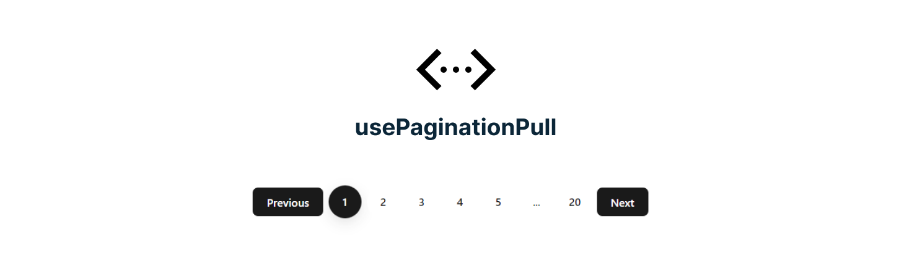

<div align="center">
  
</div>

<h2 align="center">use Pagination pull | Hook </h1>

[](https://www.npmjs.com/package/use-pagination-pull)

<p align="center">
    The usePagination hook is a custom hook to handle pagination in React applications.
<p>

 <h2 align="center" id="stacks-utilizadas">Stacks utilizadas</h2>
<p align="center">
  <a href="https://skillicons.dev">
    
  </a>
</p>

## Uso

```typescript
import usePagination from "use-pagination";

const { currentPage, handlePageChange, nextPage, prevPage, range } =
  usePagination({
    initialPage: 1,
    totalPages: 20,
  });

<div className="pagination">
  <button onClick={prevPage}>Previous</button>
  {range.map((page, i) => {
    if (typeof page === "string") {
      return (
        <span key={i} className="page">
          {page}
        </span>
      );
    }
    return (
      <button
        key={i}
        className={page === currentPage ? "page active" : "page"}
        onClick={() => handlePageChange(page)}
      >
        {page}
      </button>
    );
  })}
  <button onClick={nextPage}>Next</button>
</div>
```


## Props | hook usePagination

| Props          | Type   | Description               |
| -------------- | ------ | ------------------------- |
| totalPages     | number | The total number of pages |
| initialPage    | number | The initial page          |
| boundary       | string | The boundary              |
| onPageChange   | func   | The callback function     |
| modeInfinite   | bool   | The infinite mode         |
| hiddenBoundary | bool   | The hidden boundary       |

## Packages Status [85% 🔃]

This is a hook created with Rollup.

[](https://www.npmjs.com/package/use-pagination-pull)

## Changelog and Roadmap 
- [X] Initial release 
- [X] Documentation
- [X] Testing
- UI
- [] Create component for render the pagination styled 


## Development

To get running locally:

```
npm install
npm run storybook

# or

npm run dev
```

## Testing

```
npm run test
```

## Contributing

Please see our [contributing guide](https://github.com/geniilsonfernandes/use-pagination/blob/main/CONTRIBUTING.md)

## License

MIT License
